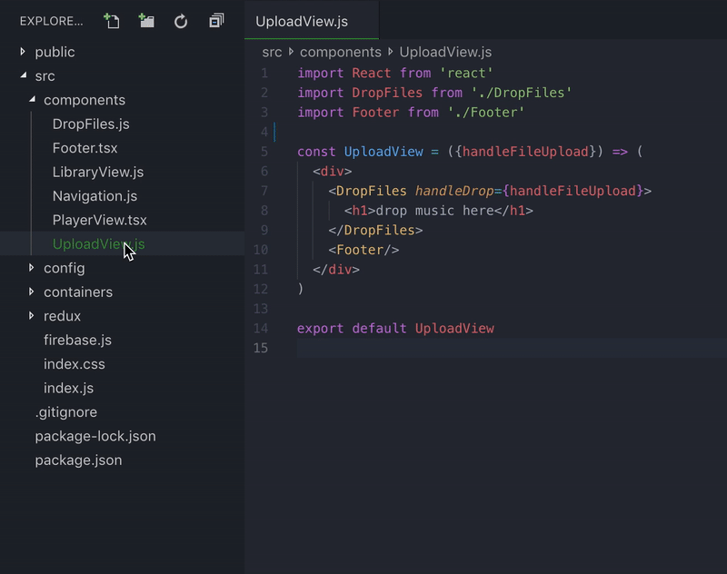

# folderize
turn javascript files into folders

### Demo


### Install
Download the latest version from the Visual Studio Marketplace [here](https://marketplace.visualstudio.com/items?itemName=ee92.folderize)

### Customize
Not everybody uses the same folder structure, that is why Folderize also gives you the possibility to customize the options you see when selecting which optional files to create.

In order to customize this extension, go to Visual Studio Code settings and search for `Folderize`, you will see an option called `optionalFilesToGenerate`. As a value it expects an array of a mix of presets(strings) or custom options(structured objects). These are explained a bit more in depth in the following subsections.

Before that, here is a simple demo of how this setting could look like:

```json
...
  "folderize.filesToGenerate": [
    "styles",
    "spec",
    {
      "id": "storybook",
      "label": "Add stories file",
      "description": "{fileName}.stories.{ext}",
      "createFile": "{fileName}.stories.{ext}",
      "importComponent": true
    }
  ]
...
```

#### Presets
As mentioned before, not everybody uses the same folder structure. That being said, there are some files that are quite common to most structures so to make it easier for you, we created a set of presets that can be of help.

##### Current list of presets:
* test: creates a `{Component}.test.{ext}` file with the Component already imported
* spec: creates a `{Component}.spec.{ext}` file with the Component already imported
* css_module: creates a `{Component}.module.css` file and imports it in the Component
* styles: creates a `{Component}.styles.{ext}` file and imports it in the Component

*Note:* both css_module and styles presets are imported in the Component with the name `styles`. If for whatever reason you need both files to be created for a component, you can override one of them with a custom option and change the import name.

#### Custom Option
If you need a file to be created that is not part of our presets, there is still a way for you to add it.

Custom options should follow the following structure:
```
{
   id: string,
   label: string,
   description: string,
   // OPTIONALS:
   createFile: string,
   importInComponentName: string,
   importComponent: boolean
}
````

##### Property breakdown

- *id:* this is used to identify the preset, if you use an id of an existing preset, it will replace it with your custom version.
- *label:* Name of the option that appears in the menu.
- *description:* Description of the option that appears in the menu. You can use `{fileName}` and `{ext}` and it will be replaced with the correct data extracted from the original file. This is useful when trying to display how the file name will end up looking like.
- *createFile:* this is the file name to create. As with description you can write `"{fileName}.example.{ext}"` if you want to make use of those properties.
- *importInComponentName:* If you want the file to be imported in the component, just give it an import name and the extension will know how and where to add it.
- *importComponent:* If you want the file to import the component, set this to true and the extension will take care of it.

##### Overriding presets
In order to override a preset you just need to define a new custom option with the same id as the preset you want to override. You need to fully override it by providing all the necessary parameter.

We recommend going to the [presets file](../blob/master/src/options/presets.ts) and copying the config you want to override to have a working base and go from there.

### Donate
If you you find this extension useful, you can make a donation [here](https://paypal.me/650egor)

### License
MIT